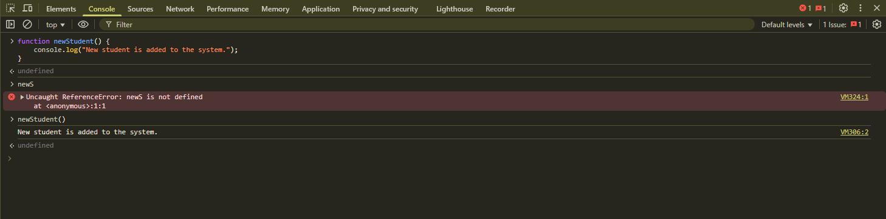
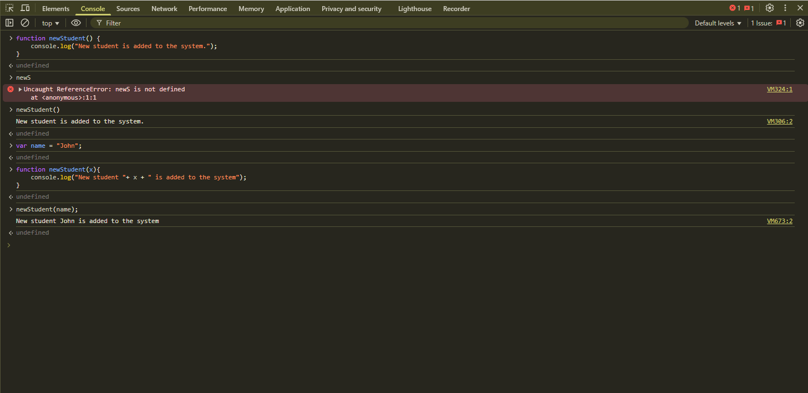
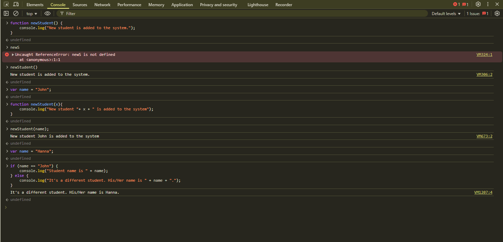
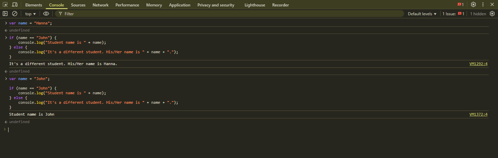
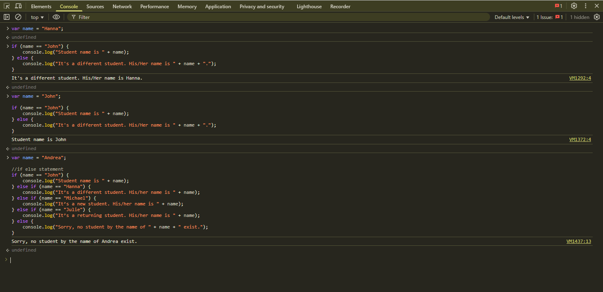
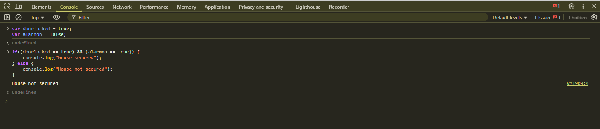
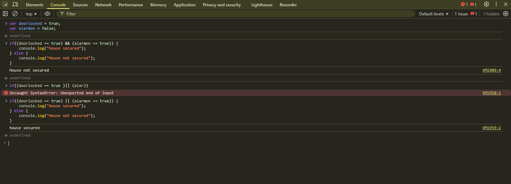
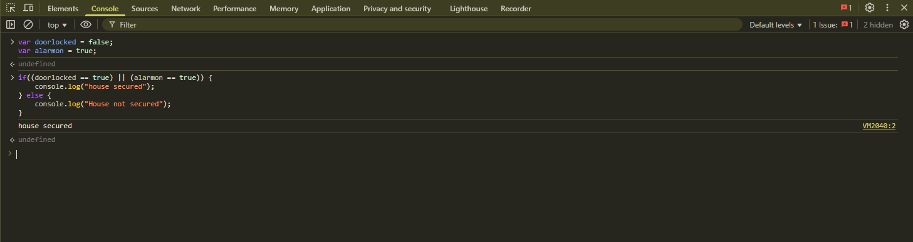
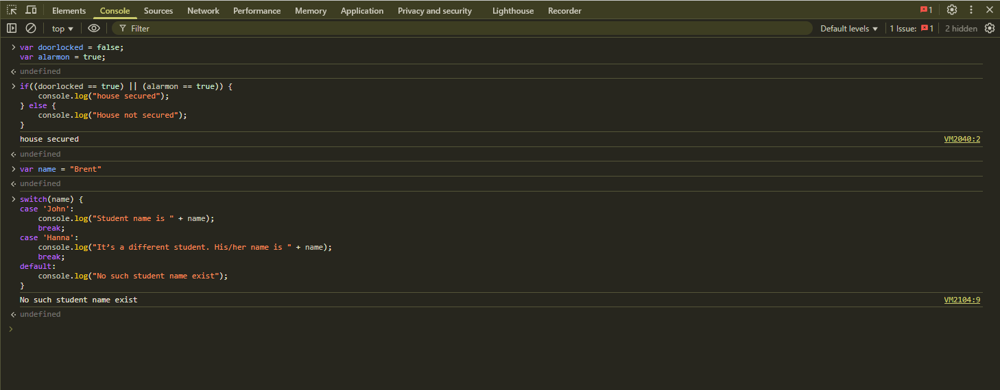

# Week-3-Day-1-Class-Exercise

## Simple Function

## Parameterized Function

## If-Else with else case

## If-Else with if case

## Multiple-If-Else 

## AND 

## OR 

## Switch Statement 
