# Week-3-Day-2-Class-Exercise

## For loop
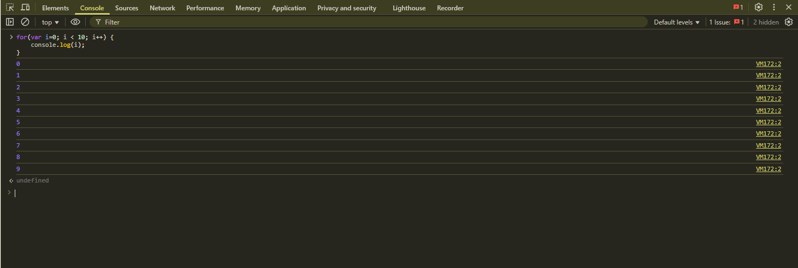

## While loop 
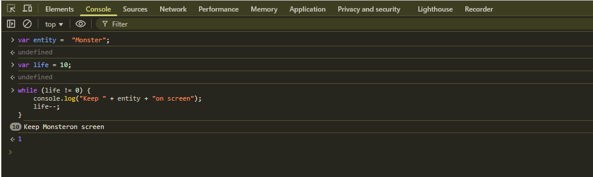

## While loop counter 
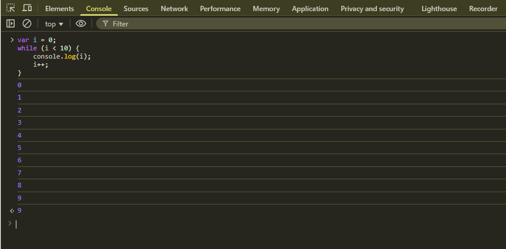

## Do-While loop
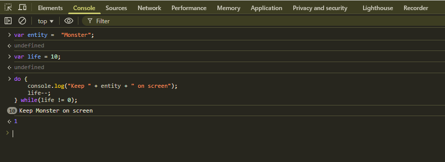

## Do-While one time
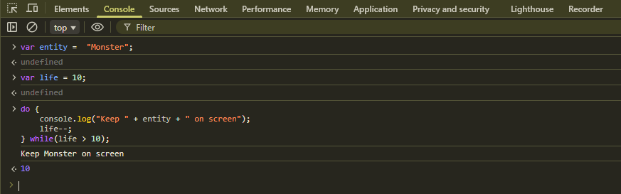

## Array - Basic
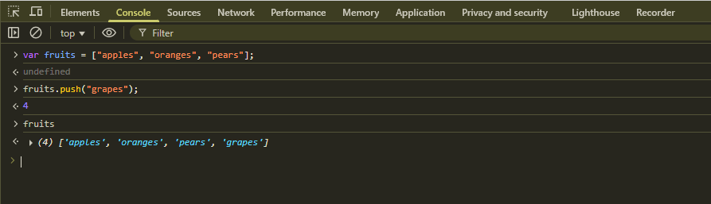

## Array pop
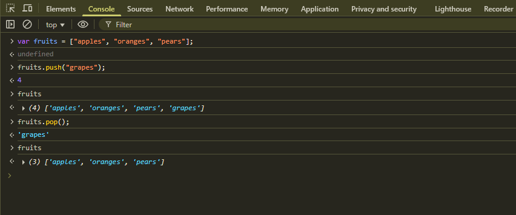

## Array shift
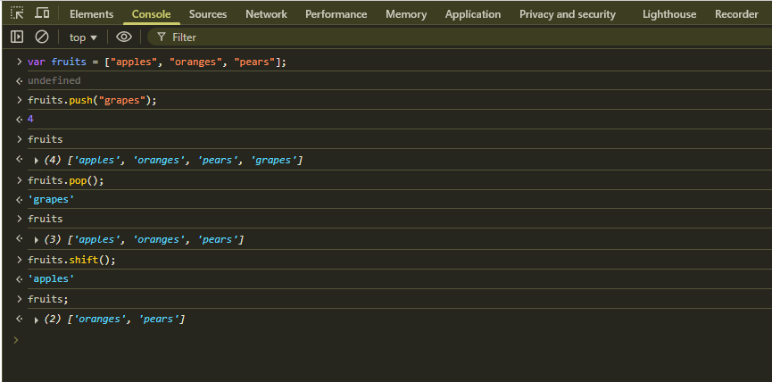

## Array unshift
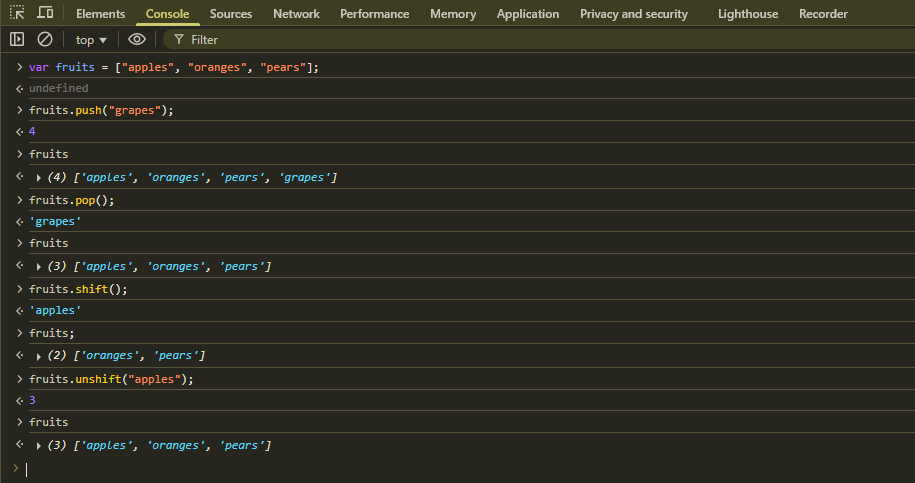

## Array slice
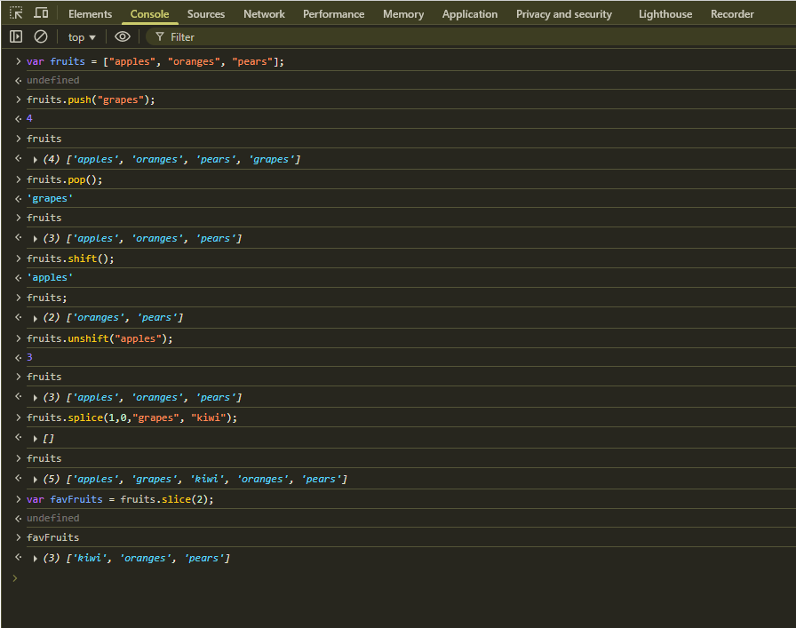

## Array splice
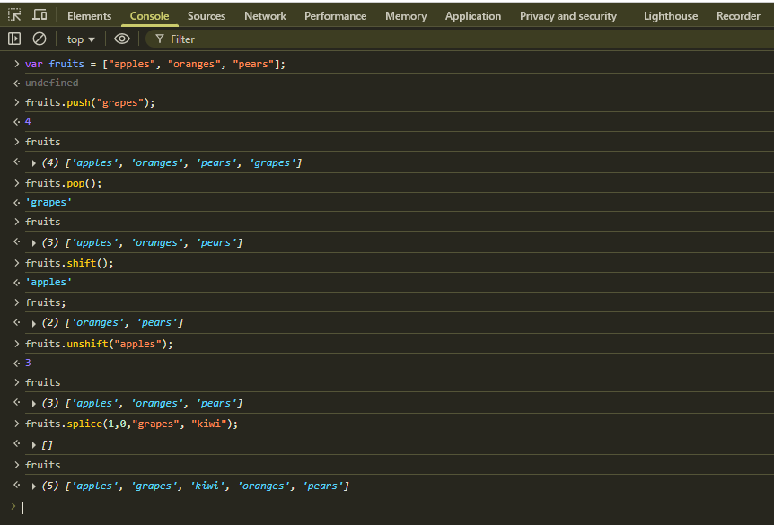

## Array sort
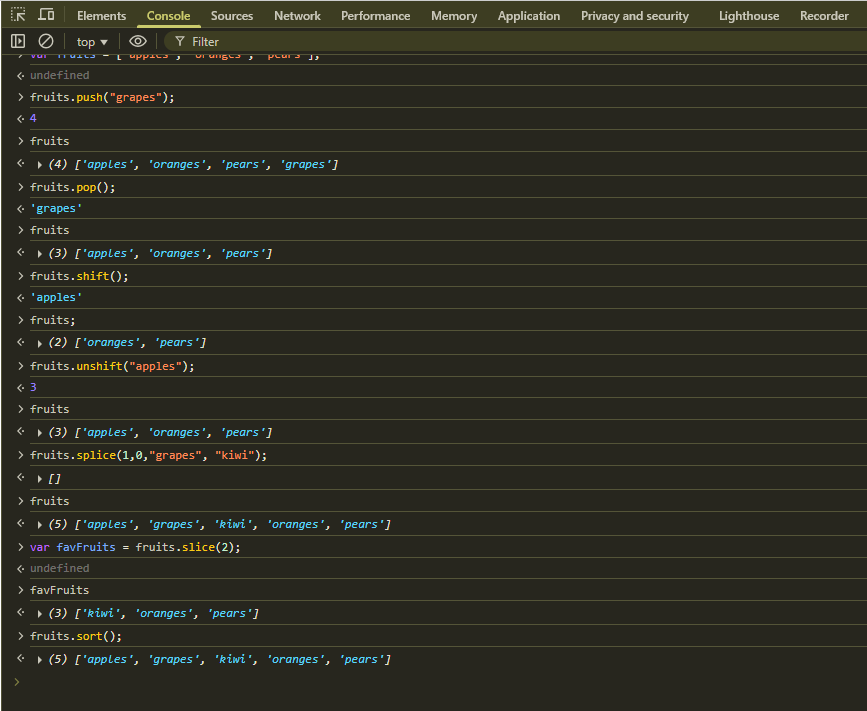

## Array reverse
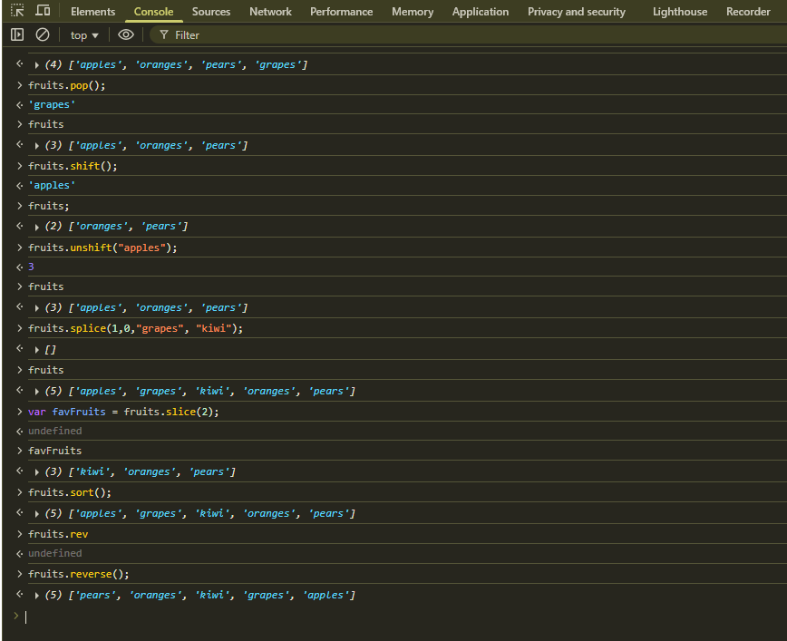

## Array concat
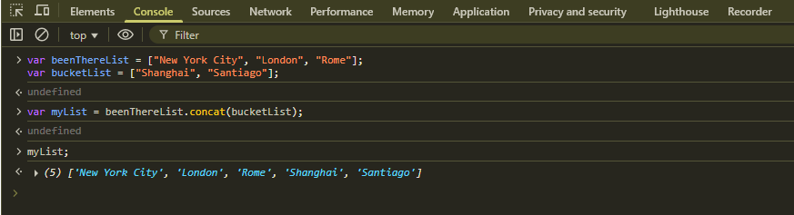

## Alert box popup
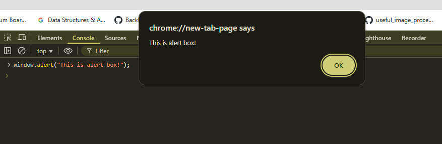

## Confirm popup
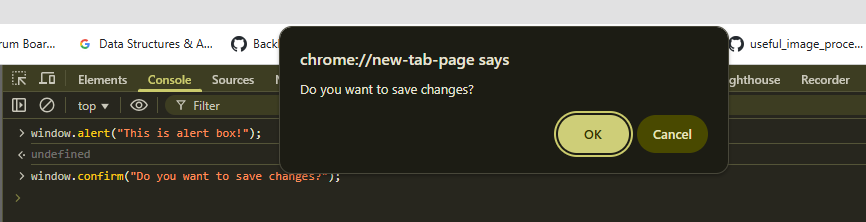

## Prompt popup
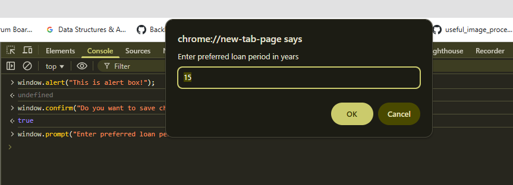
