# JavaScript Array Functions - Code Along Demo

## Array indexOf

The `indexOf()` method returns the first index at which a given element can be found in the array.

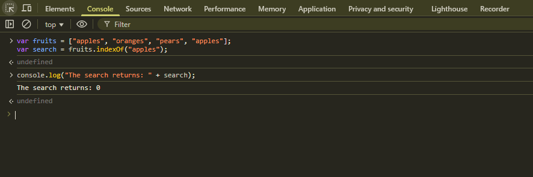

## Array indexOf (Negative Result)

Example showing when `indexOf()` returns -1 when the element is not found in the array.

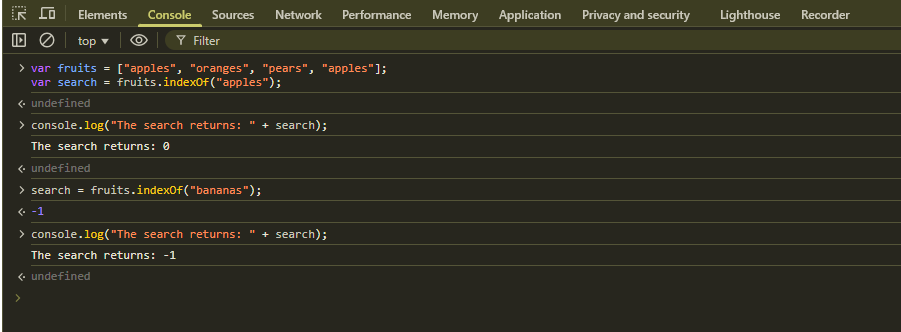

## Array lastIndexOf

The `lastIndexOf()` method returns the last index at which a given element can be found in the array.

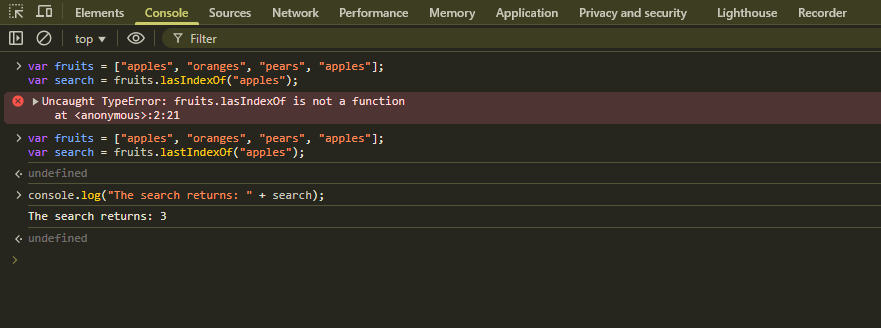

## Array forEach

The `forEach()` method executes a provided function once for each array element.

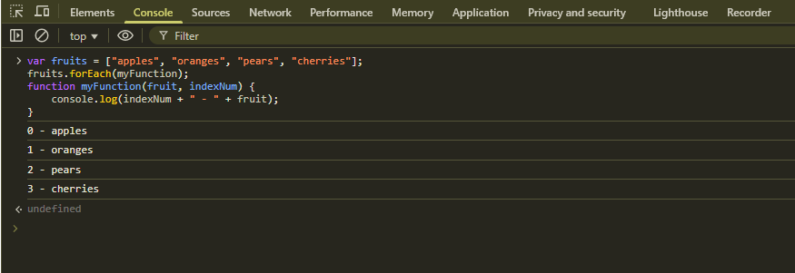

## Array includes

The `includes()` method determines whether an array includes a certain value among its entries.

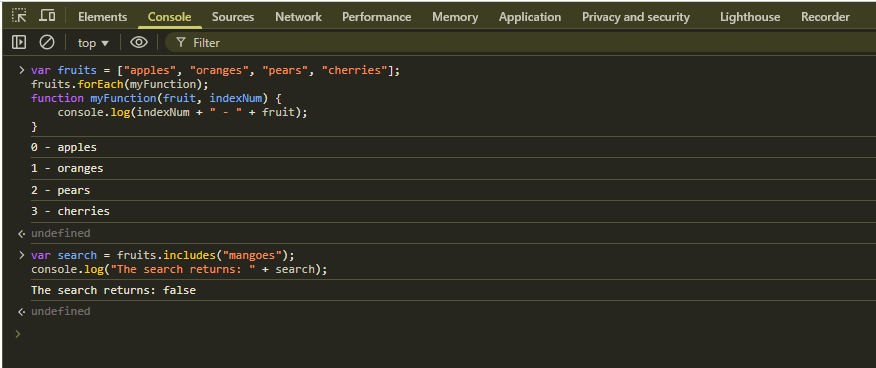

## Array Every

The `every()` method tests whether all elements in the array pass the test implemented by the provided function.

## Array Every (Returns True)

Wwhen the `every()` method returns true when all elements pass the test.

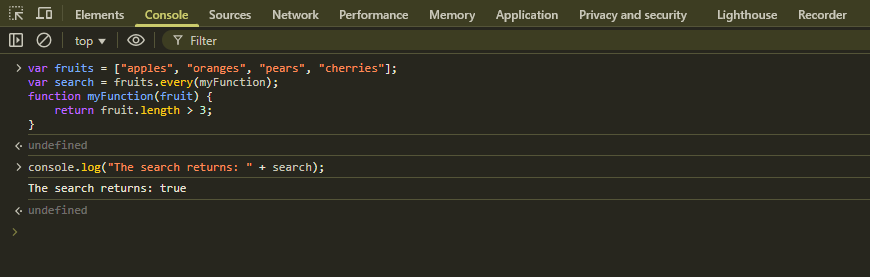

## Array Some

The `some()` method tests whether at least one element in the array passes the test implemented by the provided function.

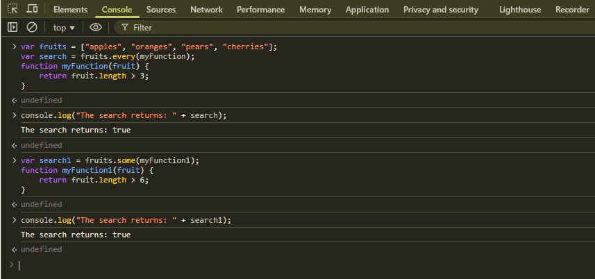

## Array Some (Returns False)

When the `some()` method returns false when no elements pass the test.

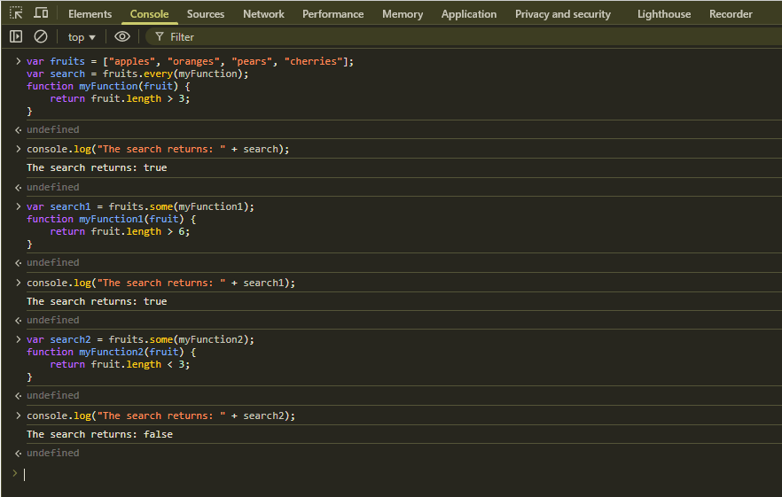

## Array Map

The `map()` method creates a new array populated with the results of calling a provided function on every element in the calling array.

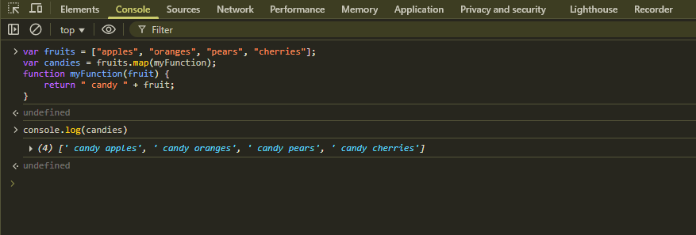

## Array Filter

The `filter()` method creates a new array with all elements that pass the test implemented by the provided function.

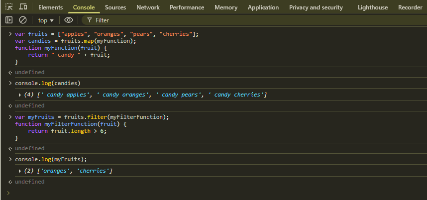

## Array Filter with Substring

Using the `filter()` method combined with `includes()` to filter arrays based on substring matching.

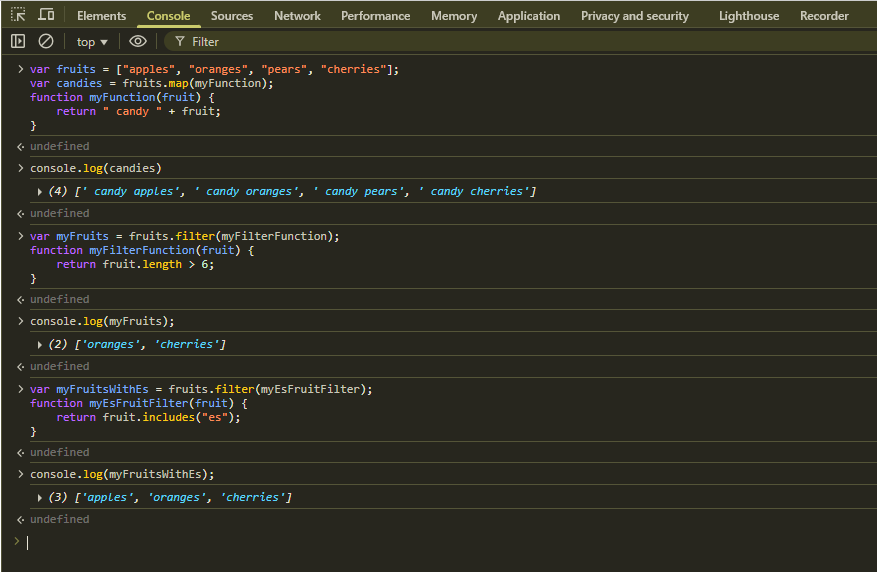

## Array Reduce

The `reduce()` method executes a reducer function on each element of the array, resulting in a single output value.

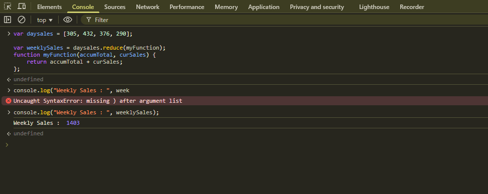

## Random Number Generation

Example of generating random numbers.

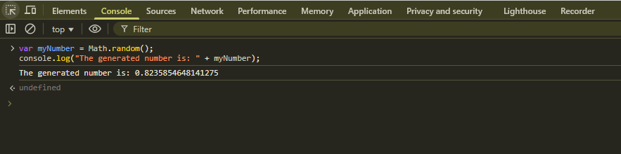