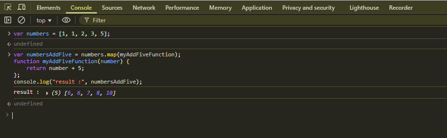
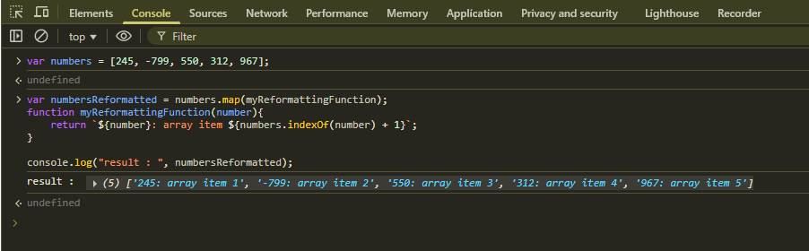

# JavaScript Array Functions - Week 4 Day 1 Group Challenge

## Array Map - Add Five

Using the `map()` method to add 5 to each element in an array. 

The `map()` method creates a new array with the results of calling a provided function on every element in the calling array.

## Array Map with indexOf

Combining the `map()` method with `indexOf()` to transform array elements based on their position. 
This demonstrates how to use multiple array methods together for more complex operations.

